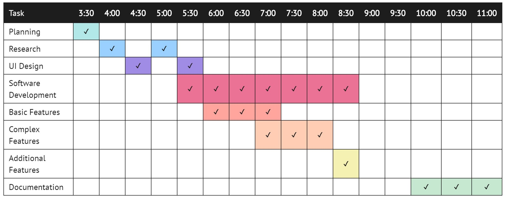

# __My Something Awesome__

> _Code Explanation_
1. These are my global variables. I have used 3 types of global variables: double, int and bool. The int variable creates a number (interger) variable which does not contain decimals, I used this for both my num and score variables, num affecting the amount of time gravity has been increasing/decreasing and score just counting the players score. An int is used here as they never require decimal places. The double is similar to an int but does contain decimal places which is effective for my gravity variable which needs to be more precisely tuned. A bool variable is a true or false statement, I have used one to check if the player is still alive.
```
double gravity = 5;
int num = 0;
bool alive = true;
int score = 0;
```

2. Here is my public MainWindow function which runs when the program begins. Firstly it initializes the componenet which is necessary for all WPF applications, it essentially begins the program. After this the MainWindow function begins the loop which runs every 0.002 seconds in my code. This loop is what contains all the checking of collisions and controls all the animations, it calls the gameTimer_Tick function. This loop uses a DispatcherTimer with an interval of 0.002 seconds, every time it ticks it calls the Event "gameTimer_Tick".
```
public MainWindow()
        {
            InitializeComponent();

            DispatcherTimer LiveTime = new DispatcherTimer();
            LiveTime.Interval = TimeSpan.FromSeconds(0.002);
            LiveTime.Tick += new EventHandler(gameTimer_Tick);
            LiveTime.Start();          
        }
```

3. Below is the main Function of my game. It consists of many different loops and parts so we will break it down further below.
```
private void gameTimer_Tick(object sender, EventArgs e)
        {
            if (alive == true)
            {
                num = num - 1;
                Thickness icon = sensor.Margin;
                Thickness image = bird.Margin;
                bird.Margin = new Thickness(image.Left, image.Top + gravity, 0, 0);
                sensor.Margin = new Thickness(icon.Left, icon.Top + gravity, 0, 0);

                Thickness marg = pipe1.Margin;
                Thickness marg1 = pipe2.Margin;
                if (marg.Left >= -85)
                {
                    pipe1.Margin = new Thickness(marg.Left - 1.5, 0, 0, 0);
                    pipe2.Margin = new Thickness(marg.Left - 1.5, marg1.Top, 0, 0);
                }
                else
                {
                    marg.Left = 485;
                    pipe1.Margin = new Thickness(marg.Left, 0, 0, 0);

                    var random = new Random();
                    int num = random.Next(350);
                    pipe1.Height = num;
                    pipe2.Margin = new Thickness(marg.Left, 0 + num + 125, 0, 0);

                    if (500 - num - 125 > 0)
                    {
                        pipe2.Height = 500 - num - 125;
                    }
                    else
                    {
                        pipe2.Height = 0.01;
                    }
                }

                Thickness marg3 = pipe3.Margin;
                Thickness marg4 = pipe4.Margin;
                if (marg3.Left >= -85)
                {
                    pipe3.Margin = new Thickness(marg3.Left - 1.5, 0, 0, 0);
                    pipe4.Margin = new Thickness(marg3.Left - 1.5, marg4.Top, 0, 0);
                }
                else
                {
                    marg3.Left = 485;
                    pipe3.Margin = new Thickness(marg3.Left, 0, 0, 0);

                    var random = new Random();
                    int num2 = random.Next(350);
                    pipe3.Height = num2;
                    pipe4.Margin = new Thickness(marg3.Left, 0 + num2 + 125, 0, 0);

                    if (500 - num2 - 125 > 0)
                    {
                        pipe4.Height = 500 - num2 - 125;
                    }
                    else
                    {
                        pipe4.Height = 0.01;
                    }
                }

                if (marg.Left == 117 || marg3.Left == 117 || marg.Left == 116 || marg3.Left == 116)
                {
                    score++;
                    Display.Content = score.ToString();
                }

                if (150 <= marg.Left && marg.Left <= 250 && (icon.Top <= pipe1.Height || icon.Top + 30 >= pipe1.Height + 125))
                {
                    PlayerDead();
                }
                else if (150 <= marg3.Left && marg3.Left <= 250 && (icon.Top <= pipe3.Height || icon.Top + 30 >= pipe3.Height + 125))
                {
                    PlayerDead();
                }

                if (num <= 0) { gravity = 3; }
                else { gravity = gravity + 0.75; }
            }
        }
```

* The first section of this code creates all the thicknesses. These thicknesses are essentially the margins of the bird and the sensor. I have used an ivisible rectangle as a sensor instead of the bird as it is easier than an image to detect collisions with the pipes. Once it has the current margin of these objects it creates a new margin with its current left position which should always remain the same (middle of screen) and adding the current value of gravity to the top margin, gravity will either send the bird up or down depending on if the user has jumped. The first if statement checks if the pipe has gone off of the screen, if this isn't the case it changes the pipe position by -1.5 pixels so it moves to the left. If it is off of the screen it resets the pipes position and then chooses a random number between 1 and 350 to determine the height of the pipe. The next if statement, imbeded inside of the last else statement checks if the pipe height is small enough to fit a second pipe on screen, if it is, it sets the second pipe height to the size of the screen - the original pipe height - the gap between pipes wanted, this gives the equation '500 - num - 125'. This could be simplified but it is easier to follow in this format. (In the above code you will see a second instance of these 2 loops, this just does the same on the second pair of pipes.)
```
if (alive == true)
            {
                num = num - 1;
                Thickness icon = sensor.Margin;
                Thickness image = bird.Margin;
                bird.Margin = new Thickness(image.Left, image.Top + gravity, 0, 0);
                sensor.Margin = new Thickness(icon.Left, icon.Top + gravity, 0, 0);

                Thickness marg = pipe1.Margin;
                Thickness marg1 = pipe2.Margin;
                if (marg.Left >= -85)
                {
                    pipe1.Margin = new Thickness(marg.Left - 1.5, 0, 0, 0);
                    pipe2.Margin = new Thickness(marg.Left - 1.5, marg1.Top, 0, 0);
                }
                else
                {
                    marg.Left = 485;
                    pipe1.Margin = new Thickness(marg.Left, 0, 0, 0);

                    var random = new Random();
                    int num = random.Next(350);
                    pipe1.Height = num;
                    pipe2.Margin = new Thickness(marg.Left, 0 + num + 125, 0, 0);

                    if (500 - num - 125 > 0)
                    {
                        pipe2.Height = 500 - num - 125;
                    }
                    else
                    {
                        pipe2.Height = 0.01;
                    }
                }
```

* This below code is the collision and score detection. The first if loop detects if the bird has successfully gone through the pipe by comparing the margin of the pipe to the center of the screen, the number the pipe would be at ended up being reliable at a margin of 117 or 116 pixels. If the player has gone through the pipe one is added to the global score variable and the score label is updated. The next if statement checks if the bird has collided with the first set of pipes it does this but first checking if any of the pipe is in the middle of the screen where the bird could collide with, given by the statement (150 <= marg.Left && marg.Left <=250) this checks if the front of the pipe is between pixels 150 and 250. Then it checks if the bird has hit the top or bottom pipe, this takes the position of the bird and compares it to the position of the pipes (icon.Top <= pipe1.Height || icon.Top + 30 >= pipe1.Height + 125). The next else if statement does the same for the second pair of pipes. If the bird has not hit a pipe it goes to the final if else statement whhich sets the gravity.
```
if (marg.Left == 117 || marg3.Left == 117 || marg.Left == 116 || marg3.Left == 116)
                {
                    score++;
                    Display.Content = score.ToString();
                }

if (150 <= marg.Left && marg.Left <= 250 && (icon.Top <= pipe1.Height || icon.Top + 30 >= pipe1.Height + 125))
                {
                    PlayerDead();
                }
else if (150 <= marg3.Left && marg3.Left <= 250 && (icon.Top <= pipe3.Height || icon.Top + 30 >= pipe3.Height + 125))
                {
                    PlayerDead();
                }

if (num <= 0) { gravity = 3; }
else { gravity = gravity + 0.75; }
```

* These functions are called throughout the code. The first funtion jump is a response to a button click and sets the gravity to negative so that the bird goes up and sets num to 10 so that the bird goes up for 10 ticks of the loop. The player dead function brings up the death screen by enabling the end screen contents and changing their opacities to 100, this function also changes the bool variable 'alive' to false to tell the program that the player has died and for the large game loop to stop running. The last function is also a button click event and restarts the application on a new tab and exits the current one.
```
private void Jump(object sender, EventArgs e)
        {
            gravity = -10;
            num = 10;
        }

private void PlayerDead()
        {
            endscreen.Opacity = 100;
            end.Opacity = 100;
            jump.IsEnabled = false;
            jump.Opacity = 0;
            text.Opacity = 100;
            finalscore.Opacity = 100;
            finalscore.Content = score;
            reset.IsEnabled = true;
            reset.Opacity = 100;
            alive = false;
        }

private void Restart(object sender, EventArgs e)
        {
            Application.Restart();
            Environment.Exit(0);
        }
```


> _Evaluation_

The main problem with my Something Awesome was my horrible time management. Due to my lack of time management I did not discover the impossibility of some of my ideas until the last few days of my project, ideas such as a Snapchat streaks sender had to quickly be discarded. In fact I did not come up with my idea until 3:30 the day of which the assessment was due. Apart from time management skills I could've used a language and application like Java to code my game as I had no prior experience coding games or animations within WPF and it does not seem to be the most efficient way to code a game. 

The things I did well though were good and efficient research into new things I needed to know and manipulating the things I did know effectively to suit my new needs such as using a timer from my Advanced Software Class to run the recurring game loop. The game turned out well but was rushed and I probably could've taken on a more complex project or added small features such as actual pipes instead of rectangles, the bird rotating or a moving background to give a more authentic game experience.


## __Planning__
 >_UI Design_
 
The UI of my game is going to be directly based on the original flappy bird game. This means a bird icon the character controls, moving 'pipes' along the screen and the classic flappy bird background. In one of the top corners will be the players current score and in the bottom left corner will be a large 'JUMP' button which the player controls the bird with. If the player dies there will be an end screen which the player can view their final score, it will also contain a restart button for the user to reset the program easily.

>_Feasability_

The game flappy bird is really quite simple and easily coded. I have made this more challenging by using a WPF framework, one which is generally not used for games by most of the coding community. This presents the challenge of less resources available online from other coders and more trialing and working out logic on my half. I still think the game will be quite feasible with this framework and with these new challenges, even if I have wasted most of my time. 

>_Scope_




